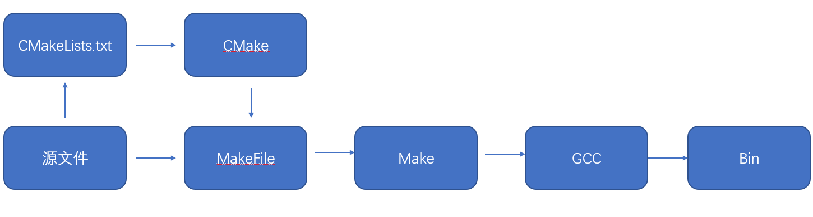

[TOC]


# 	1.CMake

> CMake是一个开源、跨平台的编译。测试和打包工具，它使用比较简单的语言描述①编译、②安装的过程，输出Makefile或者project文件，再去执行构建。

## 1.1gcc/make/cmake

关系图如下



## 1.2cmake一般流程

1. 生成构建系统 (buildsystem, 比如make工具对应的Makefile)；
2. 执行构建（比如make），生成目标文件；
3. 执行测试、安装或打包。

### 1.2.1生成构建系统

通过 `cmake` 命令生成构建系统

通过 `cmake --help` 可以看到cmake命令支持的详细参数，常用的参数如下：

| 参数 | 含义                                                         |
| ---- | ------------------------------------------------------------ |
| -S   | 指定源文件根目录，必须包含一个CMakeLists.txt文件             |
| -B   | 指定构建目录，构建生成的中间文件和目标文件的生成路径         |
| -D   | 指定变量， 格式为-D  \<var\> = \<value\>, -D后面的空格可以省略 |

比如， 指定使用当前目录作为源文件目录， 其中包含`CMakeLists.txt` 文件； 使用`build`目录作为构建目录；设定`CMAKE_BUILD_TYPE`的值为`Debug`, 变量`AUTHOR`的值为`DylanOfficial`：

```cmake
cmake -S . \
	-B build \
	-DCMAKE_BUILD_TYPE=Debug \
	-DAUTHOR=DylanOfficial
```

> 使用-D设置的变量再CMakeLists.txt中生效， 可以设置cmake的内置支持的一些变量控制构建的行为；当然也可以使用自定义的变量，在CMakeLists.txt中自行判断做不同的处理。

### 1.2.2执行构建

使用`cmake --build [<dir> | --preset <preset>]` 执行构建。

这里要指定的目录就是前面生成构建系统时指定的构建目录。常用的参数如下：

| 参数                     | 含义                                         |
| ------------------------ | -------------------------------------------- |
| --target                 | 指定构建目标代替默认的构建目标，可以指定多个 |
| --parallel/-j [\<jobs\>] | 指定构建目标时使用的进程数                   |

```cmake
cmake --build build -j 8
```

> 在这一步，如果使用的是make构建工具，则可以在构建目录下直接使用make命令。

## 1.3CMake语法

[]: https://cmake.org/cmake/help/v3.20/manual/cmake-commands.7.html	"CMake-commands"

CMake的命令有不同种类，包括①脚本命令、②项目配置命令和③测试命令。

CMake语言在项目配置中组织为三种源文件类型：

1. 目录命令： `CMakeLists.txt`， 针对的是一个目录，描述如何针对目录 （Source tree） 生成构建系统，会用到项目配置命令；
2. 脚本命令： `<script>.cmake`,  就是一个CMake语言的脚本文件，可使用`cmake -P` 直接执行，只能包含脚本命令；
3. 模块命令：`<module>.cmake`, 实现一些模块化的功能， 可以被前面两者包含，比如`include(CTest)` 启用测试功能。


### 1.3.1注释

行注释使用“#”；块注释使用“#[[ comments ]]”。

```cmake
# Multi line comments follow
#[[
Author: DylanOfficial, 
Date: 2022-06-25
]]
```

### 1.3.2变量

CMake中使用`set`和`unset`命令设置或者取消设置变量。CMake中有以下常用变量类型。

**一般变量**

设置的变量可以是字符串，数字或者列表（直接设置多个值，或者使用分号隔开的字符串，格式为"v1;v2;v3"）,比如：

```cmake
# Set variable
set(AUTHOR_NAME Dylan)

# Set list
set(SLOGAN_ARR "To;be")

# Set number but saved in string~
set(NUM 30) # Saved as string, but can compare with other number string
# Set Bool
set(FLAG ON) # Bool value
```

主要有以下要点：

1. 如果要设置的变量值包括空格，则需要使用双引号或者使用"\\"（可以省略双引号）；
2. 如果设置多个值或者字符串值得中间有";"，则保存成list，同样是以"；"分割得字符串；
3. 变量可以被list命令操作，单个值的变量相当于只有一个元素的列表；
4. 引用变量：`${<variable>}`，在`if()`条件判断中可以简化为只用变量名`<variable>`。

**Cache变量**

Cache变量（缓存条目， cache entries）的作用主要是为了提供用户配置选项，如果用户没有指定，则使用默认值，设置方法如下：

```cmake
# set(<variable> <value>... CACHE <type> <docstring> [FORCE])
set(CACHE_VAR "Default cache value" CACHE STRING "A sample for cache variable")
```

要点：

1. 主要为了提供可配置变量，比如编译开关；
2. 引用CACHE变量：`$CACHE{<variable>}`。

> Cache变量会被保存在构建目录下的CMakeCache.txt中，缓存起来之后是不变的，除非重新配置更新

**环境变量**

修改当前处理进程的环境变量，设置和引用格式为

```cmake
# set(ENV{<variable>} [<value>])
set(ENV{ENV_VAR} "$ENV{PATH}")
messgae("Value of ENV_VAR: $ENV{ENV_VAR}")
```

和CACHE变量类似，要引用环境变量，格式为：`$ENV{<variable>}`。

### 1.3.3条件语句

支持的语法有：

1. 字符串比较，比如：STREQUAL、STRLESS、STRGREATER等；
2. 数值比较，比如：EQUAL、LESS、GREATER等；
3. 布尔运算，AND、OR、NOT；
4. 路径判断，比如：EXISTS、IS_DIRECTORY、IS_ABSOLUTE等；
5. 版本号判断；等等；
6. 使用小括号可以组合多个条件语句，比如：（cond1） AND （cond2 OR cond3）

对于常量：

1. ON、YES、TRUE、Y和非0值均被是为`True`；
2. 0、OFF、NO、FALSE、N、IGNORE、空字符串、NOTFOUND、和以"-NOTFOUND"结尾的字符串均视为`False`。

对于变量：

​	只要其值不是常量中`False`的情形，则均视为`True`。

## 1.4常用的脚本命令

下面是一些常用的CMake命令，可用于基础的CMake脚本编写。

### 1.4.1消息打印

`message`命令，用于打印log，打印不同信息，常用命令给格式为：

```cmake
message([<mode>] "message" ...)
```

其中`mode`就相当于打印的等级，常用的有这几个选项：

1. 空或者`NOTICE`：比较重要的信息，如前面演示中的格式
2. `DEBUG`：调试信息，主要针对开发者
3. `STATUS`:项目使用者可能比较关心的信息，比如提示当前使用的编译器
4. `WARNING`：CMake警告，不会打断进程
5. `SEND_ERROR`： CMake错误，会继续执行，但是会跳过生成构建系统
6. `FATAL_ERROR`： CMake致命错误，会终止进程

### 1.4.2条件分支

这里以`if()/elseif()/else()/endif()`举例，`for/while`循环也是类似的：

```cmake
set(EMPTY_STR "")
if (NOT EMPTY_STR AND FLAG AND NUM LESS 50 AND NOT NOT_DEFINE_VAR)
	message("The first if branch...")
elseif (EMPTY_STR)
	message("EMPTY_STR is not empty")
else ()
	message("All other case")
endif()
```

### 1.4.3列表操作

`list`也是CMake的一个命令，有很多有用的子命令，比较常用的有：

1. `APPEND`, 往列表中添加元素；
2. `LENGTH`， 获取列表元素个数；
3. `JOIN`， 将列表元素用指定的分隔符连接起来；

示例如下：

```cmake
set(SLOGAN_ARR TO be)	# Saved as "To;be"
set(AUTHOR_NAME Dylan Official)
list(APPEND SLOGAN_ARR a)
list(APPEND SLOGAN_ARR ${AUTHOR_NAME})
list(LENGTH SLOGAN_ARR SLOGAN_ARR_LEN) # store the LENGTH of SLOGAN_ARR into SLOGAN_ARR_LEN
list(JOIN SLOGAN_ARR " " SLOGAN_STR) 
message("Slogan list length: ${SLOGAN_ARR_LEN}")
message("Slogan list: ${SLOGAN_ARR}")
message("Slogan list to string: ${SLOGAN_STR}\n")
```

### 1.4.4文件操作

CMake的`file`命令支持的操作比较多，可以读写、创建或复制文件和目录、计算文件hash、下载文件、压缩文件等等。使用的语法都比较类似，以笔者常用的递归遍历文件为例，下面是获取src目录下两个子目录内所有c文件的列表的示例：

```cmake
file(GLOB_RECURSE ALL_SRC
	src/module1/*.c
	src/module2/*.c
)
```

> `GLOB_RECURSE`表示执行递归查找，查找目录下所有符合指定正则表达式的文件。

### 1.4.5配置文件生成

使用`configure_file`命令可以将配置文件模板中的特定内容替换，生成目标文件。输入文件中的内容`@VAR@`或者`${VAR}`在输出文件中将被对应的变量值替换。使用方式为：

```cmake
set(VERSION 1.0.0)
configure_file(version.h.in "${PROJECT_SOURCE_DIR}/version.h")
```

假设`version.h.in`的内容为：

```C
#define VERSION "@VERSION@"
```

那么生成的`version.h`的内容为：

```c
#define VERSION "1.0.0"
```

### 1.4.6执行系统命令

使用`execute_process`命令可以执行一条或者顺序执行多条系统命令，对于需要使用系统命令获取一些变量值是有用的。比如获取当前仓库最新提交的commit的commit id：

```
execute_process(COMMAND bash "-c" "git rev-parse --short HEAD" OUTPUT_VARIABLE COMMIT_ID)
```

### 1.4.7查找库文件

通过`find_library`在指定的路径和相关默认路径下查找指定名字的库，常用的格式如下：

```
find_library(<VAR> name1 [path1 path2 ...])
```

其中， \<var\> 用于存储该命令执行的结果，也就是找到的库的全路径（包括库名），name1用于存储需要寻找的库名，[path1 path2 ...]用于存储查找库名的根路径

找到的库就可以被其他target使用，表明依赖关系。

### 1.4.8include其他模块

`include`命令将cmake文件或者模块加载并执行。比如：

```
include(CPack) #开启打包功能
include(CTest) #开启测试相关功能
```

CMake自带有很多有用的模块，可以看看官网的链接：

[]: https://cmake.org/cmake/help/latest/manual/cmake-modules.7.html	"cmake-modules"

对支持的功能稍微有所了解，或许有需要再细看文档。

当然，如果感兴趣，也可以直接看CMake安装路径下的目录`CMake\share\cmake-<version>\Modules`中的模块源文件。

# 2.CMakeLists.txt

> CMake通过CMakeLists.txt配置项目的构建系统，配合使用cmake命令行工具生成构建系统并执行编译、测试，相比于手动编写构建系统（如Makefile）要高效许多。对于C/C++项目开发，非常值得学习掌握。

本章将会介绍如何书写一个完备的`CMakeLists.txt`文件，满足一般项目的基础构建要求，CMake的语言将会更多介绍项目配置命令，主要有以下内容：

1. 设置一些自定义编译控制开关和自定义编译变量控制编译过程
2. 根据不同编译类型配置不同的编译选项和链接选项
3. 添加头文件路径、编译宏等常规操作
4. 编译生成不同类型的目标文件，包括可执行文件、静态链接库和动态链接库
5. 安装、打包和测试

## 2.1基础配置

下面先介绍一些CMake项目通常都需要进行的配置。下面的内容以`make`作为构建工具作为示例。

### 2.1.1设置项目版本和生成version.h

一般来说，项目一般需要设置一个版本号，方便进行版本的发布，也可以根据版本对问题或者特性进行追溯和记录。

通过project命令配置项目信息，如下：

```cmake
project(CMakeTemplate VERSION "1.0.0" LANGUAGES "C;CXX")
```

第一个字段是项目名称；通过`VERSION`指定版本号，格式为`main.minor.patch.tweak`，并且CMake会将对应的值分别赋值给以下变量（如果没有设置，则为空字符串）：

```cmake
PROJECT_VERSION,       <PROJECT-NAME>_VERSION
PROJECT_VERSION_MAJOR, <PROJECT-NAME>_VERSION_MAJOR
PROJECT_VERSION_MINOR, <PROJECT-NAME>_VERSION_MINOR
PROJECT_VERSION_PATCH, <PROJECT-NAME>_VERSION_PATCH
PROJECT_VERSION_TWEAK, <PROJECT-NAME>_VERSION_TWEAK
```

因此，结果`configure_file`命令，可以配置自动生成版本头文件，将头文件版本号定义成对应的宏，或者定义成接口，方便在代码运行的时候了解当前的版本号。

比如：

```cmake
configure_file(src/c/cmake_template_version.h.in "${PROJECT_SOURCE_DIR}/src/c/cmake_template_version.h")
```

假如`cmake_template_version.h.in`内容如下：

```c
#define CMAKE_TEMPLATE_VERSION_MAJOR @CMakeTemplate_VERSION_MAJOR@
#define CMAKE_TEMPLATE_VERSION_MINOR @CMakeTemplate_VERSION_MINOR@
#define CMAKE_TEMPLATE_VERSION_PATCH @CMakeTemplate_VERSION_PATCH@
```

执行cmake配置构建系统后，将会自动生成文件：`cmake_template_version.h`，其中`@<var-name>@`将会被替换为对应的值：

```c
#define CMAKE_TEMPLATE_VERSION_MAJOR 1
#define CMAKE_TEMPLATE_VERSION_MINOR 0
#define CMAKE_TEMPLATE_VERSION_PATCH 0
```

### 2.1.2指定编程语言版本

为了在不同机器上编译更加统一，最好指定语言的版本，比如声明C使用`c99`标准，C++使用`C++11`标准：

```cmake
set(CMAKE_C_STANDARD 99)
set(CMAKE_CXX_STANDARD 11)
```

这里设置的变量都是`CMAKE_`开头（包括`project`命令自动设置的变量），这类变量都是CMake的内置变量，正是通过修改这些变量的值来配置CMake构建的行为。

> `CMAKE_`、`_CMAKE`或者以下划线开头后面加上任意CMake命令的变量名都是CMake保留的。

### 2.1.3配置编译选项

通过命令`add_compile_options`命令可以为所有编译器配置编译选项（同时对多个编译器生效）；通过设置变量`CMAKE_C_FLAGS`可以配置c编译器的编译选项；而设置变量`CMAKE_CXX_FLAGS`可配置针对c++编译器的编译选项。比如：

```cmake
add_compile_options(-Wall -Wextra -pedantic -Werror)
set(CMAKE_C_FIAGS "${CMAKE_C_FLAGS} -pipe -std=c99")
set(CMAKE_CXX_FLAGS "${CMAKE_CXX_FLAGS} -pipe -std=c++11")
```

### 2.1.4配置编译类型

通过设置变量`CMAKE_BUILD_TYPE`来配置编译类型，可设置为：`Debug`, `Release`、 `RelWithDebInfo`、 `MinSizeRel`等，比如：

```cmake
set(CMAKE_BUILD_TYPE Debug)
```

当然， 更好的方式应该是在执行`cmake`命令的时候通过参数`-D`指定：

`cmake -B build -DCMAKE_BUILD_TYPE=Debug`

如果设置编译类型为`Debug`，那么对于c编译器，CMake会检查是否有针对此编译类型的编译选项`CMAKE_C_FLAGS_DEBUG`，如果有，则将它的配置内容加到`CMAKE_C_FLAGS`中。

可以针对不同的编译类型设置不同的编译选项，比如对于`Debug`版本，开启调试信息，不进行代码优化：

```cmake
set(CMAKE_C_FLAGS_DEBUG "${CMAKE_C_FLAGS_DEBUG} -g -O0")
set(CMAKE_CXX_FLAGS_DEBUG "${CMAKE_CXX_FLAGS_DEBUG} -g -O0") 
```

对于`Release`版本，不包含调试信息，优化等级设置为2：

```CMAKE
set(CMAKE_C_FLAGS_RELEASE "${CMAKE_C_FLAGS_RELEASE} -O2")
set(CMAKE_CXX_FLAGS_RELEASE "${CMAKE_CXX_FLAGS_RELEASE} -O2")
```

### 2.1.5添加全局宏定义

通过命令`add_definitions`可以添加全局的宏定义，在源码中就可以通过判断不同的宏定义实现相应的代码逻辑。用法如下：

```cmake
add_definitions(-DDEBUG -DDYLAN_OFFICIAL)
```

### 2.1.6添加include目录

通过命令`include_directories`来设置头文件的搜索目录，比如：

```
include_directories(src/c)
```

## 2.2编译目标文件

一般来说，编译目标（target）的类型有静态库、动态库喝可执行文件。这时编写`CMakeLists.txt`主要包括两步：

1. 编译：确定编译目标所需要的源文件
2. 链接：确定链接的时候需要依赖的额外的库

下面以开源项目（cmake-template）来演示。项目的目录结构如下：

```
C:\USERS\LENOVO\DESKTOP\CUDA\CMAKE_STUDY\CMAKE-TEMPLATE
│  CMakeLists.txt
│  
├─src
│  └─c
│      │  cmake_template_version.h.in
│      │  main.c
│      │  
│      └─math
│              add.c
│              add.h
│              minus.c
│              minus.h
│              
└─test
    └─c
            test_add.cc
            test_minus.cc
```

项目的构建任务为：

1. 将math目录编译成静态库，命名为math
2. 编译main.c为可执行文件demo，依赖math静态库
3. 编译test目录下的测试程序，可以通过命令执行所有的测试
4. 支持通过命令将编译产物安装及打包

### 2.2.1编译静态库

这一步需要将项目目录路径`src/c/math`下的源文件编译为静态库，那么需要获取编译此静态库需要的文件列表，可以使用`set`命令，或者`file`命令来进行设置。比如：

```cmake
file(GLOB_RECURSE MATH_LIB_SRC
		src/c/math/*.c	
	)
add_library(math STATIC ${MATH_LIB_SRC})

```

使用`file`命令获取`src/c/math`目录下所有的`*.c`文件，然后通过`add_library`命令编译名为`math`的静态库，库的类型是第二个参数`STATIC`指定的。

> 如果指定为`SHARED`则编译的就是动态链接库。

### 2.2.2编译可执行文件

通过`add_executable`命令来往构建系统中添加一个可执行构建目标，同样需要指定编译需要的源文件。但是对于可执行文件来说，有时候还会依赖其他的库，则需要使用`target_link_libraries`命令来生命构建此可执行文件需要链接的库。

在示例项目中，`main.c`就使用了`src.c.math`下实现的一些函数接口，所以依赖于前面构建的`math`库。所以在`CMakeLists.txt`中添加以下内容：

```cmake
add_executable(demo src/c/main.c)
target_link_libraries(demo math)
```

第一行说明编译可执行文件`demo`需要的源文件（可以指定多个源文件，此处只是以单个文件作为示例）；第二行表明对`math`库存在依赖。

此时可以在项目的根目录下执行构建和编译命令，并执行demo：

```bash
cmake -S . -B build -G "MinGW Makefiles"
cmake --build build
cd build && demo.exe
```

## 2.3安装和打包

### 2.3.1安装

对于安装来说，其实就是要指定当前项目在执行安装时，需要安装什么内容：

1. 通过`install`命令来说明需要安装的内容及目标路径；
2. 通过设置`CMAKE_INSTALL_PREFIX`变量说明安装的路径；
3. `3.15`往后的版本可以使用`cmake --install -prefix <install-path>`覆盖指定安装路径。

比如，在示例项目中，把`math`和`demo`两个目标按文件类型安装：

```cmake
install(TARGETS math demo
		RUNTIME DESTINATION bin
		LIBRARY DESTINATION lib
		ARCHIVE DESTINATION lib)
```

这里通过`TARGETS`参数指定需要安装的目标列表；参数`RUNTIME DESTINATION`、`LIBRARY DESTINATION`、`ARCHIVE DESTINATION`分别制定可执行文件、库文件、归档文件分别应该安装到安装目录下哪个子目录。

如果制定`CMAKE_INSTALL_PREFIX`为`/usr/local`，那么`math`库会被安装到路径`/usr/local/lib/`目录下而`demo`可执行文件则在`/usr/local/bin/`目录下。

> `CMAKE_INSTALL_PREFIX`在不同的系统上有不同的默认值，使用的时候最好显示指定路径。

同时，还可以使用`install`命令安装头文件：

```cmake
file(GLOB_RECURSE MATH_LIB_HEADERS src/c/math/*.h)
install(FILES ${MATH_LIB_HEADERS} DESTINATION include/math)
```

假如将安装到当前目录的`output`文件夹下，可以执行：

```bash
cmake -S. -Bbuild -G"MinGW Makefiles" -DCMAKE_BUILD_TYPE=Debug -DCMAKE_INSTALL_PREFIX="./output"
cmake --build build
cmake --install build --prefix output
```

可以看到安装了前面`install`命令指定要安装的文件，并且不同类型的目标文件安装到了不同子目录。

### 2.3.2打包

要使用打包功能，需要执行`include(CPack)`启用相关的功能，在执行构建编译之后使用`cpack`命令行工具进行打包安装；对于make工具，也可以使用命令`make package`。

打包的内容就是`install`命令安装的内容，关键需要设置的变量有：

|                          |                                                              |
| ------------------------ | ------------------------------------------------------------ |
| CPACK_GENERATOR          | 打包使用的压缩工具，比如"ZIP"                                |
| CPACK_OUTPUT_FILE_PREFIX | 打包安装的路径前缀                                           |
| CPACK_INSTALL_PREFIX     | 打包压缩包的内部目录前缀                                     |
| CPACK_PACKAGE_FILE_NAME  | 打包压缩包的名称，由CPACK_PACKAGE_NAME、CPACK_PACKAGE_VERSION、CPACK_SYSTEM_NAME三部分构成 |

比如：

```cmake
include(CPack)
set(CPACK_GENERATOR "ZIP")
set(CPACK_SET_DESTDIR ON)
set(CPACK_INSTALL_PREFIX "")
set(CPACK_PACKAGE_NAME "CMakeTemplate")
set(CPACK_PACKAGE_VERSION ${PROJECT_VERSION})
```

假如：`CPACK_OUTPUT_FILE_PREFIX`设置为`/usr/local/package`；`CPACK_INSTALL_PREFIX`设置为`too/long/prefix`；`CPACK_PACKAGE_FILE_NAME`设置为`CMakeTemplate-1.0.0`；那么执行打包文件的生成路径为：

```bash
/usr/local/package/CMakeTemplate-1.0.0.zip
```

解压这个包得到的目标文件则会位于以下路径：

```
/usr/local/package/too/long/prefix/
```

此时重新执行构建，使用`cpack`命令执行打包：

```
cmake -S . -B build -DCPACK_OUTPUT_FILE_PREFIX=output -G"MinGW Makefiles"
cmake --build build
cd build && cpack
```


